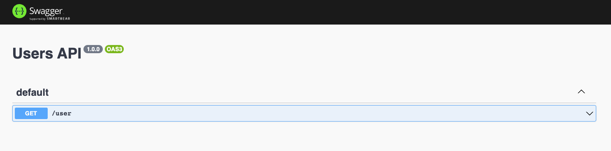
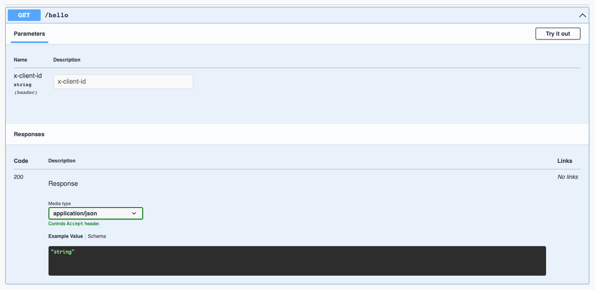
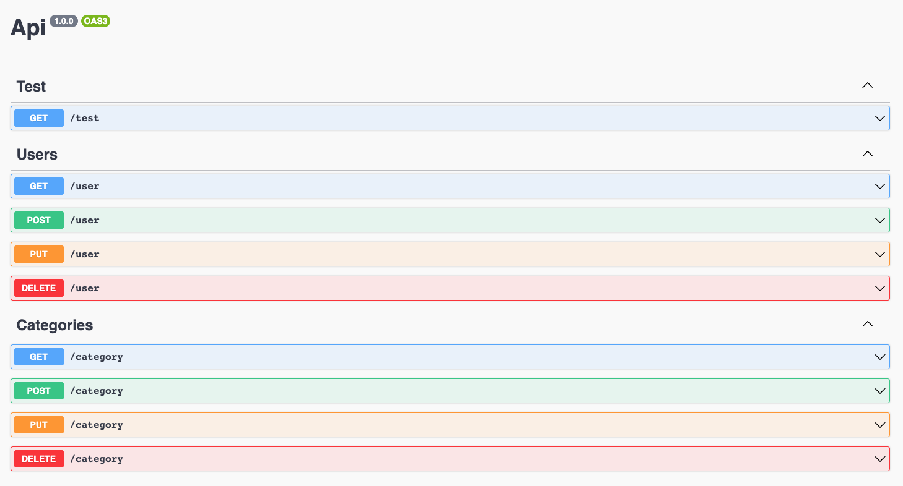

# effect-http

High-level declarative HTTP API for [effect-ts](https://github.com/Effect-TS).

## Features

- **Client derivation**. Write the api specification once, get the type-safe client with runtime validation for free.
- **OpenApi derivation**. OpenApi schema with exposed OpenApi UI out of box.
- **Batteries included server implementation**. Automatic runtime validation of input and response objects.
- **Example server derivation**. Expose HTTP server conforming the API specification.
- (TBD) **Mock client derivation**. Test safely against a specified API.

**Under development**

- [Quickstart](#quickstart)
- [Example server](#example-server)
- [Inputs](#inputs)
  - [Example](#example)
- [Headers](#headers)
- [Layers and services](#layers-and-services)
- [Logging](#logging)
- [Error handling](#error-handling)
  - [Reporting errors in handlers](#reporting-errors-in-handlers)
  - [Example API with conflict API error](#example-api-with-conflict-api-error)
- [Grouping endpoints](#grouping-endpoints)
- [Cookbook](#cookbook)
  - [Handler input type derivation](#handler-input-type-derivation)

## Quickstart

Install using

```bash
pnpm add effect-http
```

Bootstrap a simple API specification.

```typescript
import * as Http from "effect-http";

import { pipe } from "@effect/data/Function";
import * as Effect from "@effect/io/Effect";
import * as S from "@effect/schema/Schema";

const responseSchema = Schema.struct({ name: Schema.string });
const query = { id: Schema.number };

const api = pipe(
  Http.api({ title: "Users API" }),
  Http.get("getUser", "/user", {
    response: responseSchema,
    query: query,
  }),
);
```

Create the server implementation.

```typescript
const server = pipe(
  api,
  Http.server,
  Http.handle("getUser", ({ query }) => Effect.succeed({ name: "milan" })),
  Http.exhaustive,
);
```

Now, we can generate an object providing the HTTP client interface using `Http.client`.

```typescript
const client = pipe(api, Http.client(new URL("http://localhost:3000")));
```

And spawn the server on port 3000 and call it using the `client`.

```typescript
pipe(
  server,
  Http.listen(3000),
  Effect.flatMap(() => client.getUser({ query: { id: 12 } })),
  Effect.flatMap((user) => Effect.logInfo(`Got ${user.name}, nice!`)),
  Effect.runPromise,
);
```

Also, check the auto-generated OpenAPI UI running on
[localhost:3000/docs](http://localhost:3000/docs/). How awesome is that!



### Example server

`effect-http` has an ability to generate an example server
implementation based on the `Api` specification. This can be
helpful in the following and probably many more cases.

- You're in a process of designing an API and you want to have an
  OpenApi and UI you have a discuss over.
- You develop a fullstack application with frontend first approach
  you want to test the integration with a backend you haven't
  implemeted yet.
- You integrate a 3rd party HTTP API and you want to have an ability to
  perform integration tests without the need to connect to a real
  running HTTP service.

Use `Http.exampleServer` combinator to generate a `Server` from `Api`.

```typescript
import * as Http from "effect-http";

import { pipe } from "@effect/data/Function";
import * as Effect from "@effect/io/Effect";
import * as Schema from "@effect/schema/Schema";

const responseSchema = Schema.struct({ name: Schema.string });

const api = pipe(
  Http.api(),
  Http.get("test", "/test", { response: responseSchema }),
);

pipe(api, Http.exampleServer, Http.listen(3000), Effect.runPromise);
```

_(This is a complete standalone code example)_

Go to [localhost:3000/docs](http://localhost:3000/docs) and try calling
endpoints. The exposed HTTP service conforms the specified `Api` specification
and will return only valid example responses.

### Inputs

Each endpoint can declare its inputs. Inputs can be passed as

- `body` - request body
- `query` - query parameters
- `params` - path parameters
- `headers` - request headers

Inputs are specified as part of the schemas structure.

#### Example

```typescript
import * as Http from "effect-http";

import * as Schema from "@effect/schema/Schema";

const api = pipe(
  Http.api({ title: "My api" }),
  Http.get("stuff", "/stuff/:param", {
    response: Schema.struct({ value: Schema.number }),
    body: Schema.struct({ bodyField: Schema.array(Schema.string) }),
    query: { query: Schema.string },
    params: { param: Schema.string },
  }),
);
```

### Headers

Request headers are part of input schemas along with the request body or query parameters.
Their schema is specified similarly to query parameters and path parameters, i.e. using
an object mapping header name onto a schema. The example below shows an API with
a single endpoint `/hello` which expects a header `X-Client-Id` to be present.

```typescript
import * as Http from "effect-http";

import * as Schema from "@effect/schema/Schema";

const api = pipe(
  Http.api(),
  Http.get("hello", "/hello", {
    response: Schema.string,
    headers: { "X-Client-Id": Schema.string },
  }),
);
```

Server implementation deals with the validation the usual way. For example, if we try
to call the endpoint without the header we will get the following error response.

```json
{ "error": "InvalidHeadersError", "details": "x-client-id is missing" }
```

And as usual, the information about headers will be reflected in the generated
OpenApi UI.



**Important note**. You might have noticed the `details` field of the error response
describes the missing header using lower-case. This is not an error but rather a
consequence of the fact that HTTP headers are case-insensitive and internally `effect-http`
converts all header names to lower-case to simplify integration with the underlying
http library - [express](https://github.com/expressjs/express).

Don't worry, this is also encoded into the type information and if you were to
implement the handler, both autocompletion and type-checking would hint the
lower-cased form of the header name.

```typescript
const handleHello = ({
  headers: { "x-client-id": clientId },
}: Http.Input<typeof api, "hello">) => Effect.succeed("all good");
```

Take a look at [examples/headers.ts](examples/headers.ts) to see a complete example
API implementation with in-memory rate-limiting and client identification using headers.

### Layers and services

When constructing a `Server` implementation, the type system ensures all
the services are provided before we trigger `Http.listen`. On the type level,
one can check the handler doesn't have any remaining services that need to be injected
if the first type parameter `R` in `Effect<R, ..., ...>` is `never`.

In case, you have handlers with unresolved dependencies, you can use
`Http.provideService` combinator that will inject services into
all handlers defined in the `Server` pipeline so far.

If you decide to construct services using layers, there is the `Http.provideLayer`
combinator.

### Logging

Use `Http.setLogger` to set a logger for handler effects. The function accepts
either an instance of `Logger.Logger<I, O>` or it is possible to use following
built-in shorthands:

- `"json"` - `effect-log` json logger
- `"pretty"` - `effect-log` pretty logger
- `"default"` - `@effect/io` default logger
- `"none"` - `@effect/io` none logger - to disable logs

```typescript
import * as Http from "effect-http";

import { pipe } from "@effect/data/Function";

const api = pipe(Http.api());
const server = pipe(api, Http.server, Http.setLogger("json"));
```

### Error handling

Validation of query parameters, path parameters, body and even responses is
handled for you out of box. By default, failed validation will be reported
to clients in the response body. On the server side, you get warn logs with
the same information.

#### Reporting errors in handlers

On top of the automatic input and output validation, handlers can fail for variety
of different reasons.

Suppose we're creating user management API. When persisting a new user, we want
to guarantee we don't attempt to persist a user with an already taken name.
If the user name check fails, the API should return `409 CONFLICT` error because the client
is attempting to trigger an operatin conflicting with the current state of the server.
For these cases, `effect-http` provides error types and corresponding creational
functions we can use in the error rail of the handler effect.

##### 4xx

- 400 `Http.invalidQueryError` - _query parameters validation failed_
- 400 `Http.invalidParamsError` - _path parameters validation failed_
- 400 `Http.invalidBodyError` - _request body validation failed_
- 400 `Http.invalidHeadersError` - _request headers validation failed_
- 401 `Http.unauthorizedError` - _invalid authentication credentials_
- 403 `Http.forbiddenError` - _authorization failure_
- 404 `Http.notFoundError` - _cannot find the requested resource_
- 409 `Http.conflictError` - _request conflicts with the current state of the server_
- 415 `Http.unsupportedMediaTypeError` - _unsupported payload format_
- 429 `Http.tooManyRequestsError` - _the user has sent too many requests in a given amount of time_

##### 5xx

- 500 `Http.invalidResponseError` - _internal server error because of response validation failure_
- 500 `Http.internalServerError` - _internal server error_
- 501 `Http.notImplementedError` - _functionality to fulfill the request is not supported_
- 502 `Http.badGatewayError` - _invalid response from the upstream server_
- 503 `Http.serviceunavailableError` - _server is not ready to handle the request_
- 504 `Http.gatewayTimeoutError` - _request timeout from the upstream server_

Using these errors, `Server` runtime can generate human-readable detailsor
in HTTP responses and logs. Also, it can correctly decide what status code
should be return to the client.

#### Example API with conflict API error

Let's see it in action and implement the mentioned user management API. The
API will look as follows

```typescript
import * as Http from "effect-http";

import * as S from "@effect/schema/Schema";

const api = pipe(
  Http.api({ title: "Users API" }),
  Http.post("storeUser", "/users", {
    response: Schema.string,
    body: Schema.struct({ name: Schema.string }),
  }),
);
```

Now, let's implement a `UserRepository` interface abstracting the interaction with
our user storage. I'm also providing a mock implementation
which will always return the user already exists. We will plug the mock user repository
into our server so we can see the failure behavior.

```typescript
import * as Context from "@effect/data/Context";
import * as Effect from "@effect/io/Effect";

interface UserRepository {
  existsByName: (name: string) => Effect.Effect<never, never, boolean>;
  store: (user: string) => Effect.Effect<never, never, void>;
}

const UserRepositoryService = Context.Tag<UserRepository>();

const mockUserRepository = {
  existsByName: () => Effect.succeed(true),
  store: () => Effect.unit(),
} satisfies UserRepository;
```

And finally, we have the actual `Server` implementation.

```typescript
import { pipe } from "@effect/data/Function";

const handleStoreUser = ({ body }: Http.Input<typeof api, "storeUser">) =>
  pipe(
    Effect.flatMap(UserRepositoryService, (userRepository) =>
      userRepository.existsByName(body.name),
    ),
    Effect.filterOrFail(
      (alreadyExists) => !alreadyExists,
      () => Http.conflictError(`User "${body.name}" already exists.`),
    ),
    Effect.flatMap(() =>
      Effect.flatMap(UserRepositoryService, (repository) =>
        repository.store(body.name),
      ),
    ),
    Effect.map(() => `User "${body.name}" stored.`),
  );

const server = pipe(
  api,
  Http.server,
  Http.handle("storeUser", handleStoreUser),
  Http.provideService(UserRepositoryService, mockUserRepository),
  Http.exhaustive,
);

Effect.runPromise(pipe(server, Http.listen(3000)));
```

Try to run the server and call the `POST /user`.

_Server_

```bash
$ pnpm tsx examples/conflict-error-example.ts

18:36:40 (Fiber #0) INFO    Server listening on :::3000
18:36:44 (Fiber #1) TRACE   POST /users
18:36:44 (Fiber #1) WARN    POST /users failed
{ errorTag: ConflictError, error: User "patrik" already exists. }
```

_Client_ (using [httpie cli](https://httpie.io/cli))

```bash
$ http localhost:3000/users name="patrik"

HTTP/1.1 409 Conflict
Connection: keep-alive
Content-Length: 68
Content-Type: application/json; charset=utf-8
Date: Sat, 15 Apr 2023 16:36:44 GMT
ETag: W/"44-T++MIpKSqscvfSu9Ed1oobwDDXo"
Keep-Alive: timeout=5
X-Powered-By: Express

{
    "details": "User \"patrik\" already exists.",
    "error": "ConflictError"
}
```

### Grouping endpoints

To create a new group of endpoints, use `Http.apiGroup("group name")`. This combinator
initializes new `ApiGroup` object. You can pipe it with combinators like `Http.get`,
`Http.post`, etc, as if were defining the `Api`. Api groups can be combined into an
`Api` using a `Http.addGroup` combinator which merges endpoints from the group
into the api in the type-safe manner while preserving group names for each endpoint.

This enables separability of concers for big APIs and provides information for
generation of tags for the OpenApi specification.

```typescript
import * as Http from "effect-http";

import { pipe } from "@effect/data/Function";
import * as Effect from "@effect/io/Effect";
import * as S from "@effect/schema/Schema";

const responseSchema = Schema.struct({ name: Schema.string });

const testApi = pipe(
  Http.apiGroup("test"),
  Http.get("test", "/test", { response: responseSchema }),
);

const userApi = pipe(
  Http.apiGroup("Users"),
  Http.get("getUser", "/user", { response: responseSchema }),
  Http.post("storeUser", "/user", { response: responseSchema }),
  Http.put("updateUser", "/user", { response: responseSchema }),
  Http.delete("deleteUser", "/user", { response: responseSchema }),
);

const categoriesApi = pipe(
  Http.apiGroup("Categories"),
  Http.get("getCategory", "/category", { response: responseSchema }),
  Http.post("storeCategory", "/category", { response: responseSchema }),
  Http.put("updateCategory", "/category", { response: responseSchema }),
  Http.delete("deleteCategory", "/category", { response: responseSchema }),
);

const api = pipe(
  Http.api(),
  Http.addGroup(testApi),
  Http.addGroup(userApi),
  Http.addGroup(categoriesApi),
);

pipe(api, Http.exampleServer, Http.listen(3000), Effect.runPromise);
```

_(This is a complete standalone code example)_

The OpenApi UI groups endpoints using the specified groups.



## Cookbook

### Handler input type derivation

In non-trivial applications, it is expected the `Server` specification
and handlers are separated. If we define schemas purely for the purpose
of defining the `Api` we'd be forced to derive their type definitions
only for the type-safety of `Server` handlers. Instead, `Http` provides
the `Input` type helper which accepts a type of the `Api` and operation
id type and produces type covering query, params and body schema type.

```typescript
import * as Http from "effect-http";

import { pipe } from "@effect/data/Function";
import * as Effect from "@effect/io/Effect";
import * as S from "@effect/schema/Schema";

const api = pipe(
  Http.api(),
  Http.get("stuff", "/stuff", {
    response: Schema.string,
    query: Schema.struct({ value: Schema.string }),
  }),
);

// NOTICE: the input type gets correctly derived
const handleStuff = ({ query }: Http.Input<typeof api, "stuff">) =>
  Effect.succeed("test");

const server = pipe(
  api,
  Http.server("My api"),
  Http.handle("stuff", handleStuff),
  Http.exhaustive,
);
```

_(This is a complete standalone code example)_
